# Project Background

This project analyses Shopee Thailand's promotional campaign programme across 2022 to 2025, covering five recurring annual events (Songkran Sale, 9.9 Sale, 10.10 Sale, 11.11 Sale, and 12.12 Sale) run across four campaign mechanics spanning five product categories (Home, Electronics, Fashion, Groceries, and Beauty), totalling 20 campaigns over four years. The goal is to evaluate which campaigns and mechanics consistently outperform normal trading days, identify structural revenue problems limiting the programme's potential, and determine where platform resources are being misallocated.

Insights and recommendations are provided on the following key areas:

- **Campaign Effectiveness:** Which campaign mechanics and events consistently generate lift above normal trading days, how the buyer acquisition role of campaigns has evolved, and what drives the conversion advantage on campaign days.
- **Revenue Leakage:** Assessment of cancellation and refund rates during campaigns versus non-campaign days.
- **Category Performance:** Which product categories drive campaign GMV and revenue.
- **Conversion Funnel:** Where buyers drop off between campaign and non-campaign days, identification of the highest-impact abandonment stage, and what session engagement data reveals about buyer intent outside campaign periods.

 

The dashbaord schemas created for this analysis can be found [here](schema_creations.sql).

The SQL queries used to create the tables for this analysis can be found [here](shopee_cam_create_table_script.sql).

Targeted SQL queries regarding the following findings can be found [here](report_findings_final.sql).

# Data Structure & Initial Checks

The dataset provided consists of 11 tables, with approximately 4.5 million records spanning 2022 to 2025. Of these, 7 tables are used in this analysis: *shopee_orders*, *shopee_order_items*, *shopee_campaigns*, *shopee_products*, *shopee_product_campaign*, *shopee_website_sessions*, and *shopee_session_activities* Seven tables are used in this analysis; the remaining four are excluded due to limited analytical value for the purposes of this report.

| Table | Rows | Description |
|---|---|---|
| shopee_orders_thailand | 300,000 | One row per order. Contains *campaign_id* — the primary and only reliable campaign attribution source used throughout this analysis. |
| shopee_order_items_thailand | 480,481 | One row per product line item. Contains *line_total*, *item_status (Completed / Cancelled / Refunded)*, *discount_percent*, and *commission amounts*. |
| shopee_campaigns_thailand | 20 | Campaign definitions including name, mechanic type, start and end dates. |
| shopee_products_thailand | 4,880 | Product catalogue with category, commission rate, and maintenance rate. |
| shopee_product_campaign_thailand | 21,894 | Products enrolled in campaigns with offered discount percentages. |
| shopee_website_sessions_thailand | 500,000 | Session-level traffic with device type, campaign attribution, and order conversion flag. |
| shopee_session_activities_thailand | 2,780,000 | Page-level activity within sessions mapped to funnel stages (Home → Product → Cart → Checkout → Billing → Thank You). |

# Executive Summary

### Overview of Findings

Shopee Thailand’s campaign programme grew campaign revenue 2,197% over three years, from 249K THB in 2022 to 5.72M THB in 2025, with no change in campaign count or scheduling. Across the full period, a typical campaign day generated 1.96x the GMV of a typical non-campaign day, rising to 7.46x by 2025 as the platform’s buyer base scaled. Campaign days also became a stronger acquisition channel over time: by 2024 and 2025, they were bringing in more than twice as many new buyers per day as organic non-campaign days. The programme has clearly matured into an effective revenue engine, but three structural issues continue to limit its upside.

The three most important things a campaign strategy stakeholder should know:

**1. Discount campaigns consistently    outperform baseline while flash-sales rely on a handful of exceptional events.**

Discount generated around three times more GMV per day than a typical non-campaign day across every event. Most flash-sale campaigns ran below baseline, with only a few Q4 2025 events driving the mechanic's headline numbers. Whether flash-sale's strong 2025 results are repeatable or a one-year spike remains to be seen.

**2. 31.9M THB in GMV is lost every year to cancellations at a rate identical to non-campaign days, and the platform cannot explain it.**

Campaign leakage (25.77%) versus non-campaign leakage (25.00%) is a 0.77 percentage point gap, confirming campaigns do not cause the problem. But without cancellation reason codes, the platform has no data to act on. Every 1 percentage point reduction recovers 1.28M THB in realized GMV at zero additional cost.

**3.Home and Electronics are the entire revenue engine of the campaign programme.**

Home and Electronics together generate 94.5% of campaign GMV from 54.3% of orders. Campaign enrollment strategy and seller recruitment should reflect this concentration.

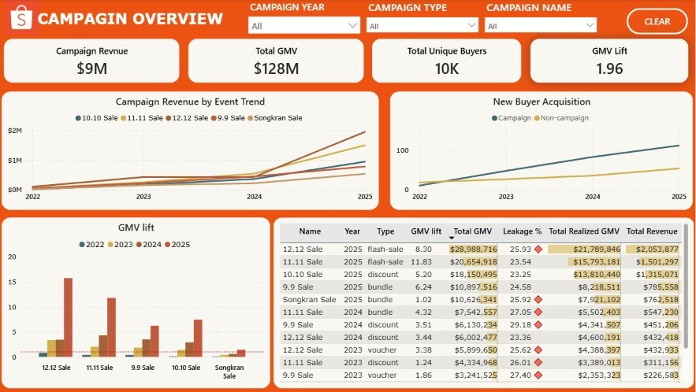
Complete dashboard video can be found [here](graphs/video.mp4).

# Insights Deep Dive

### Campaign Effectiveness

- **Discount campaigns are the most reliable mechanic for generating consistent incremental sales, while flash-sales depend heavily on a small number of standout events.** 

    Among the four campaign mechanics run over four years, discount campaigns generated around three times more GMV per day than a typical non-campaign day across every event, with no single discount campaign carrying the others.
    
    The majority of flash-sale campaigns generated less GMV per day than a normal trading day, with only a handful of exceptional Q4 2025 events driving the mechanic's headline numbers. 
    
    Bundle and voucher campaigns sit in the middle, both generating positive uplift, but with only four and two campaigns respectively the sample sizes are too small to draw reliable conclusions.

    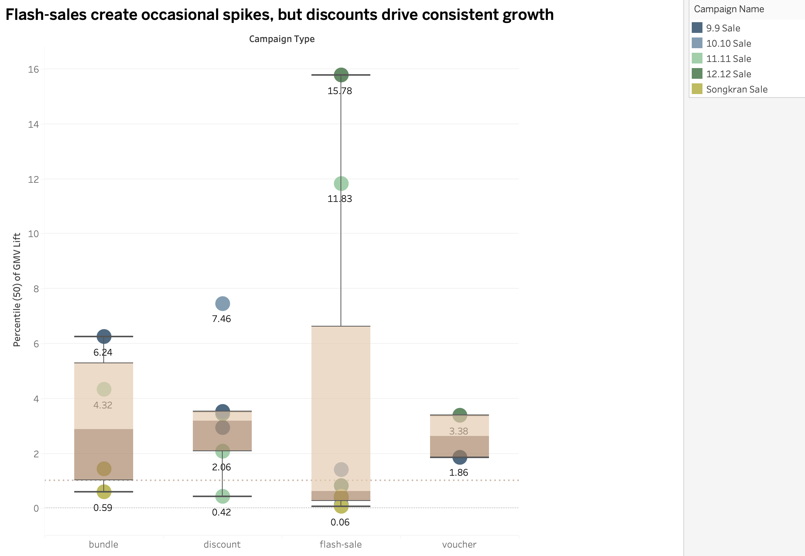
    <em>Flash-sale performance improved dramatically from near zero in 2022 to its strongest results in 2025, but Whether 2025 marks a structural turning point for flash-sale or a one-year spike driven by the exceptional Q4 audience scale requires further observation.</em>

- **Songkran runs for three days, yet it remains the weakest-performing of the five events.** 

    Every other campaign runs for one day. Songkran runs for three. Despite a 23-fold growth in the platform buyer base and conversion improving from 33% to 95% between 2022 and 2025, Songkran still generated the lowest platform revenue among all events and only surpassed the non-campaign baseline in its fourth year of operation. 
    
    Switching mechanics twice did not change the outcome. Songkran ran as flash-sale in 2022 and 2023, then bundle in 2024 and 2025, while the same mechanics performed substantially better in other events.

    One contributing factor is timing. Platform GMV follows a clear seasonal pattern where sales accelerate throughout the year, peaking sharply in Q4. Songkran runs in April, at the start of the year when platform GMV is structurally lower than later months
    

    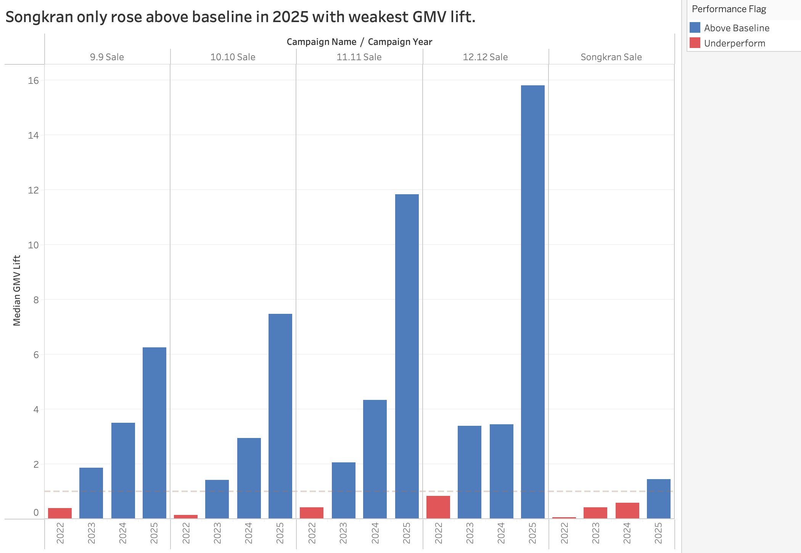
    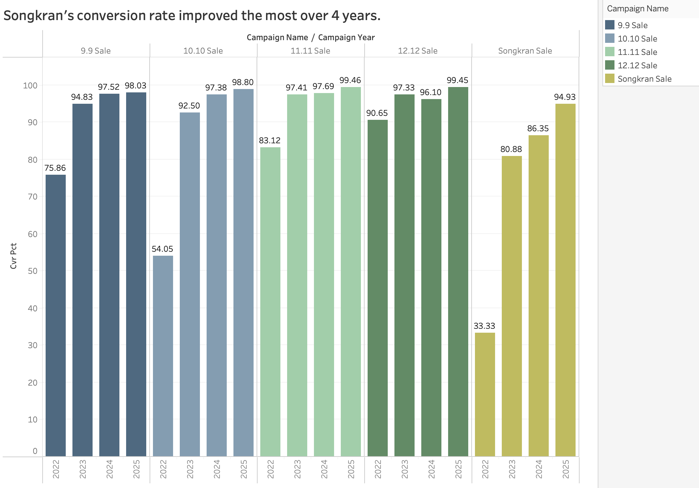
    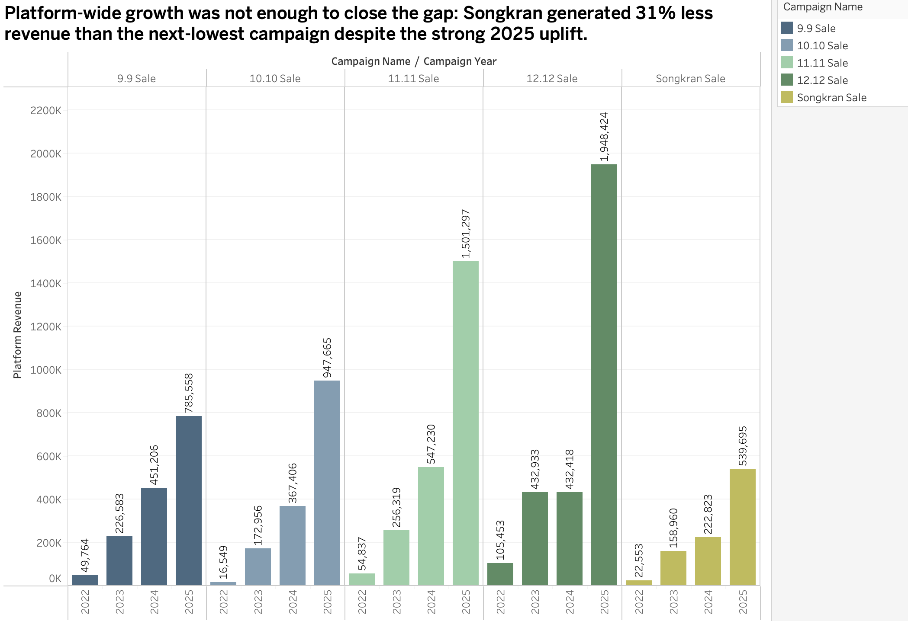
    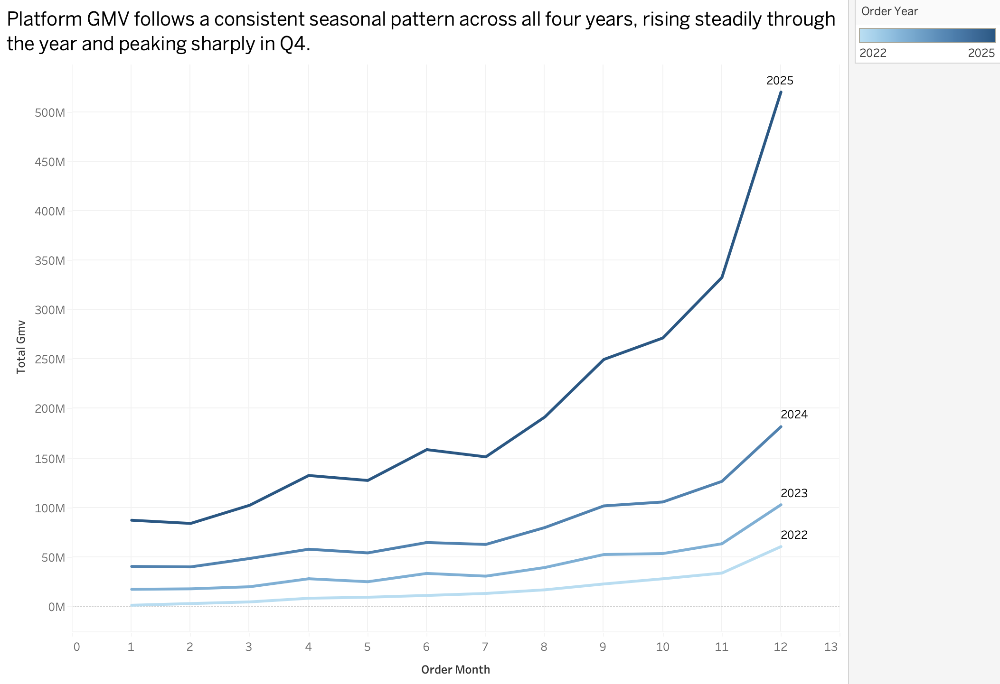

- **Campaigns have consistently outpaced organic days at acquiring new buyers across all four years.** 
    Campaigns have consistently outpaced organic days at acquiring new buyers across all four years. Campaign revenue grew from 249K THB in 2022 to 5.72M THB in 2025 with exactly five campaigns per year on the same schedule throughout. Unique campaign buyers grew from 271 to 6,151 over the same period, and campaign revenue followed the same curve almost exactly. 

    In 2022 campaigns were already acquiring new buyers at nearly 7 times the organic rate (131 vs 19 per day). Both lines grew steadily; by 2025 campaigns reached 336 new buyers per day against an organic baseline of 54, maintaining the same structural advantage throughout. The platform's organic growth set the floor and campaigns consistently drove well above it.

    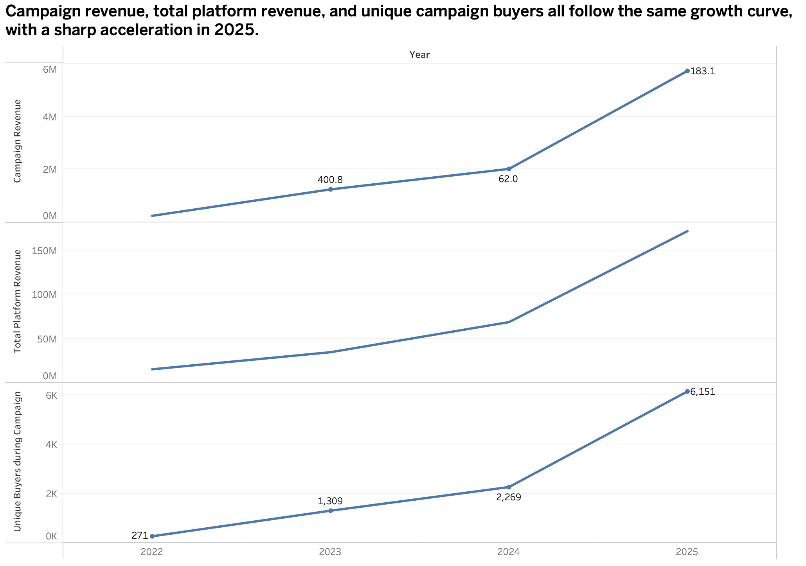
     <em>All three metrics grew steadily from 2022 to 2024, then accelerated sharply in 2025. Campaign revenue reached 5.72M THB (+183% YoY), total platform revenue crossed 170M THB, and unique campaign buyers reached 6,151. Five campaigns ran every year on the same schedule throughout. The parallel curves suggest that buyer base growth is closely linked to revenue growth, though both are likely influenced by broader platform expansion during the same period.</em>

 
    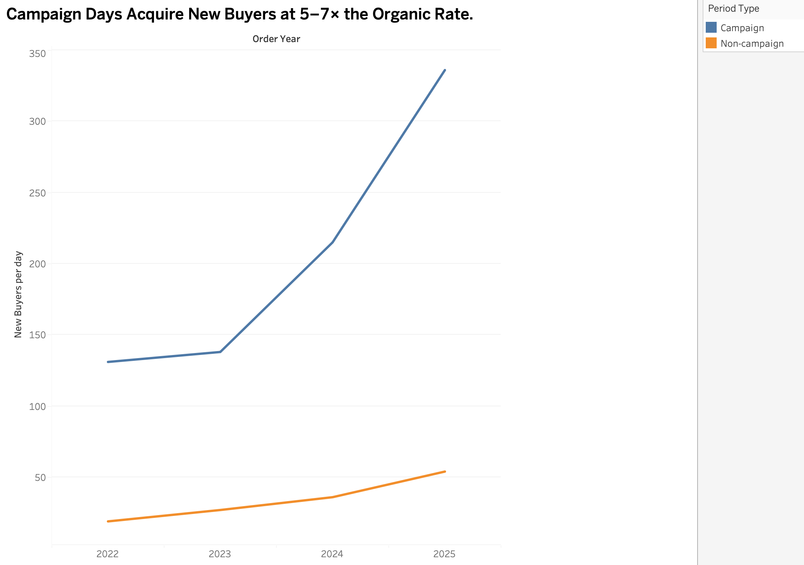

### Revenue Leakage

- **One quarter of every campaign's GMV is never collected, and the platform has no data on why.** 

    Campaign leakage (25.77%) is virtually identical to non-campaign leakage (25.00%), confirming this is a platform-wide structural problem, not a campaign design problem. Absolute leaked GMV grew from 1.05M THB in 2022 to 19.4M THB in 2025 as campaign scale grew, and will continue to widen as the platform grows. The rate has actually improved over the same period, with 2025 campaigns clustering at 23.5 to 24.8%, approaching the non-campaign baseline.
    
    The dataset contains no cancellation reason codes, making it impossible to act on the leakage without implementing them first.

    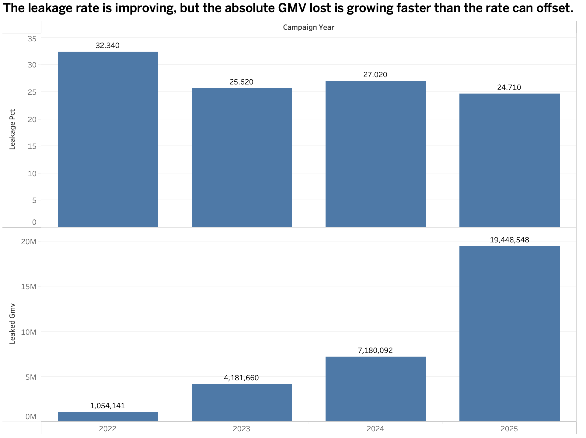
### Category Performance

- **Home and Electronics drive nearly all campaign GMV, while other categories contribute through volume.** 

    Home and Electronics together account for 94.5% of campaign GMV from 54.3% of orders. The remaining three categories, Fashion, Groceries, and Beauty, collectively generate 5.5% of GMV despite representing 45.7% of orders. This is not a category problem; it reflects product nature. A grocery basket and an electronics purchase cannot be compared on the same GMV scale.

    Within Home and Electronics, the two categories serve different buyer needs. Home drives broad participation with the highest order share at 40.8% and a median item value of 7,177 THB. Electronics drives disproportionate value with only 13.5% of orders but 31.8% of GMV at a median item value of 13,166 THB. 
    
    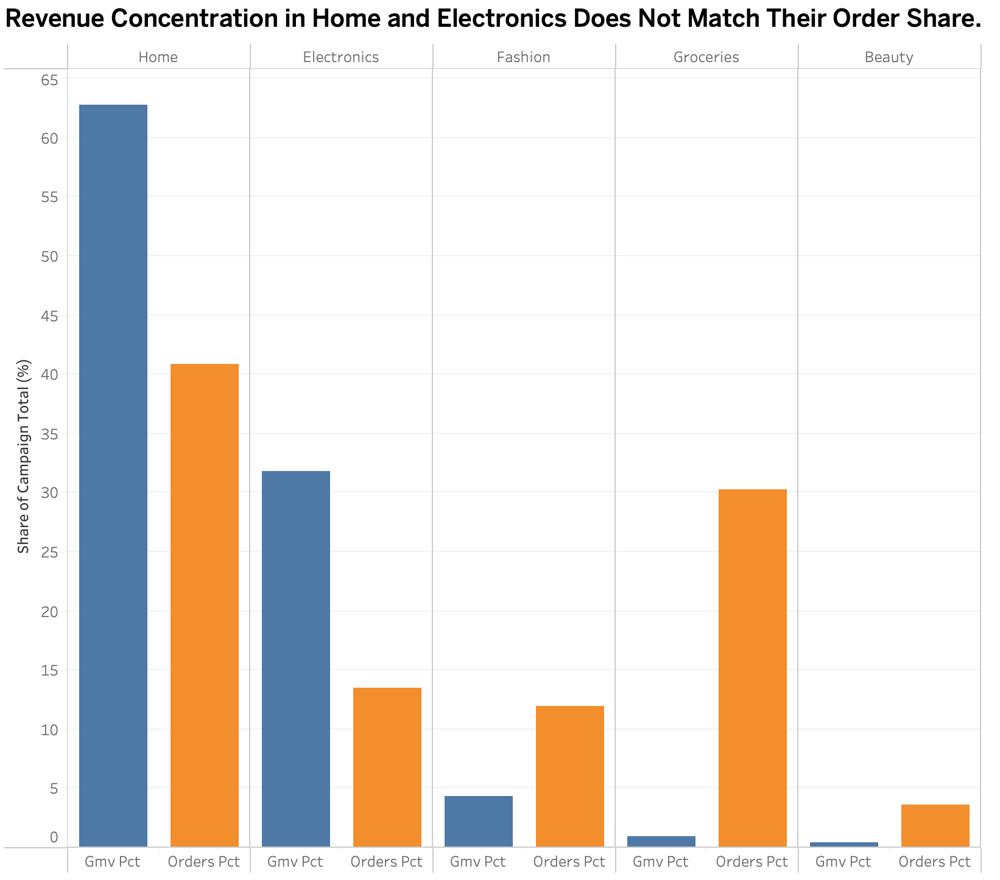
    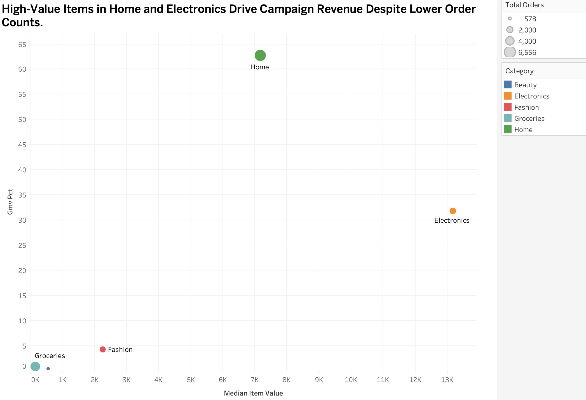

### Conversion Funnel

- **The entire conversion gap between campaign and non-campaign days is decided at one stage: Product to Cart.** 

    Campaign sessions convert at 96.57% overall versus 59.2% for non-campaign sessions, a 37 percentage point gap driven entirely by a single funnel stage. During campaigns 98.1% of buyers who view a product add it to cart. Outside campaigns 24.2% leave at that same stage without adding anything. Non-campaign buyers average 14.7 minutes per session, confirming these are engaged browsers not casual visits. Campaigns provide a deadline and a discount that converts browsing into commitment.

    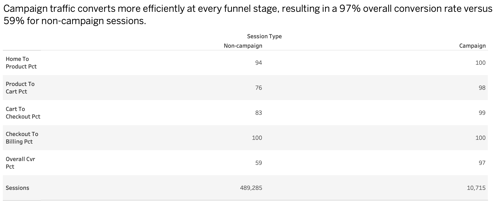

# Recommendations

Based on the insights and findings above, we would recommend the campaign strategy team to consider the following:

- **Test Songkran as a pre-event window rather than a single-day campaign**

    Songkran runs for three days, yet it remains the weakest-performing of the five annual events in this dataset. Rather than treating it as a fixed campaign window, test whether adding teaser campaigns, reminder ads, and pre-event product discovery in the weeks before Songkran improves performance.

- **Implement cancellation reason codes**
    
    The cumulative difference, 31.9M THB across four years, was lost to cancellations and refunds, and the platform has no visibility into why.
    
    Each 1 percentage point reduction in the leakage rate recovers approximately 1.28M THB in realized GMV at zero additional marketing cost. 
    
    Cancellation reason codes are standard operational practice across e-commerce platforms and enable businesses to begin diagnosing where leakage originates. 
    
    Standard candidate categories to investigate include: change of mind, delivery time expectations, shipping cost, product not as described, and seller stock failure — each of which would point to a different operational intervention if confirmed. Introduce a short mandatory reason-code list at the point of cancellation and review it regularly by category, seller type, and campaign period. 

- **Deepen seller participation in the categories that drive campaign revenue**

    Home and Electronics generate 94.5% of campaign GMV from 54.3% of orders, the concentration is not changing year over year. The lever for growing campaign GMV is therefore deepening the pool of sellers in these two categories, not broadening participation across categories that cannot move the GMV needle at current item values. 
    
    Fashion sellers offer the deepest average discounts of any category to participate yet receive the weakest return relative to that investment. Rather than restricting categories, the more effective lever is expanding the supply of high-value sellers in the categories that are already proven to sell during campaigns. 
    
    Actively recruit mid-to-high ticket Home and Electronics sellers with stronger visibility incentives and reduced enrollment friction, so each campaign starts with a larger pool of high-value products for buyers to convert on.

- **Test urgency cues on non-campaign product pages**

    24.2% of non-campaign buyers drop off at the Product to Cart stage while the same stage loses only 1.9% during campaigns. 
    
    The data suggests a closing trigger is what separates the two. Urgency cues such as upcoming campaign countdowns, low-stock notices, and price-drop alerts are reasonable hypotheses for closing that gap, though their effect in this specific context is not proven without testing. 
    
    Run a controlled A/B test on a small segment of non-campaign traffic measuring whether genuine urgency cues improve add-to-cart completion without simply shifting purchases forward to the next campaign day. Only scale if the test shows net new conversions. 

- **Invest in affiliate and referral channels to compound campaign revenue**

    Campaign days acquired new buyers at more than double the organic daily rate from 2023 onward, so buyer acquisition is a meaningful lever for future campaign revenue. 
    
    The Shopee Affiliate Program in the Philippines shows that creator-based affiliate growth can expand reach beyond major cities, which supports testing affiliate, referral, and search channels in Thailand.

# Data and Methodology Notes

The following notes document the analytical decisions, measurement definitions, and data quality resolutions made during this analysis. Each decision is supported by the data and applied consistently across all findings:

- **Campaign Attribution:** 
    
    The *is_campaign* flag in *raw_order_items* was found to be inconsistently populated — of 43,366 flagged line items, only 10,347 (23.8%) could be fully traced to a specific campaign. 
    
    All campaign analysis uses *orders.campaign_id* IS NOT NULL as the sole attribution filter. The remaining 23,393 unattributable line items are excluded from all metrics.

- **GMV Baseline Distribution:** 
    
    Daily non-campaign GMV is strongly right skewed (skew = 2.79), with a mean of 2,860,037 THB/day versus a median of 1,759,364 THB/day, a 63% gap. 
    
    The median is used as the baseline for all lift calculations to avoid overstating campaign performance.

- **Minimum Daily Volume Threshold:**           

    Baseline calculations filter to non-campaign days with at least 18 order line items, derived from the 5th percentile of daily line item counts. 

    This excludes anomalous low-volume days such as public holidays and system anomalies. The threshold is applied consistently across all findings and the *fact_daily_baseline* table.

- **Leakage and Cancellation Rate Baselines:** 

    Daily non-campaign leakage rate and cancellation rate are near-symmetric (skew below 0.9). 
    
    Median is applied for methodological consistency with the GMV baseline approach, with mean and median differing by less than 0.15 percentage points.

- **Platform Profit:** 

    Cost data including voucher subsidies, marketing spend, infrastructure costs, and staff is not present in the dataset. 
    
    All revenue figures represent gross platform earnings before any costs.

- **GMV Definition:** 

    GMV throughout this analysis refers to total booked order value — *SUM(line_total)* across all order items including those subsequently cancelled or refunded — unless explicitly qualified as Realized GMV. 
    
    The distinction is material only in the Revenue Leakage section, where total GMV (128.4M THB) and realized GMV (96.5M THB) are both named explicitly.

- **Lift Calculation:** 

    The GMV lift multiplier uses total booked GMV in both the campaign numerator and the non-campaign baseline denominator. 
    
    Since campaign leakage (25.77%) and non-campaign leakage (25.00%) are nearly identical, recalculating lift on realized GMV would change all multipliers by less than 1%, which is immaterial to every finding and recommendation.

# Key Terms

| Term | Definition |
|---|---|
| **GMV** | Total booked order value — *SUM(line_total)* across all order items including those subsequently cancelled or refunded, unless explicitly stated as Realized GMV. |
| **Realized GMV** | GMV from completed order items only. |
| **Platform revenue** | Shopee's earnings — commission fees plus maintenance fees. Approximately 7.1–7.2% of GMV. |
| **Campaign revenue** | Platform revenue attributed specifically to orders placed during a campaign (*campaign_id* IS NOT NULL). The primary measure of campaign programme performance used throughout this report. |
| **GMV lift** | Campaign daily GMV divided by the median non-campaign daily GMV baseline (1,759,364 THB/day). A lift of 1.0x means the campaign matched a typical non-campaign day. |

## References for Recommendations

- Katrina B. & Benedict L. (2023, July 11). When do Thailand's top ecommerce shopping events take place? Janio Asia. https://janio.asia/resources/articles/major-e-commerce-shopping-events-thailand
- Reschar, M. (2024, September 8). Reduce order cancellation rates (by you and your customers). Fluent Commerce. https://fluentcommerce.com/resources/blog/reduce-cancellation-rates-by-enhancing-customer-satisfaction/
- Shoplazza Content Team. (2026, March 6). 10 urgency and scarcity marketing strategies to boost sales. Shoplazza. https://www.shoplazza.com/blog/urgency-scarcity-marketing-strategies
- Philstar. (2025, November 8). Shopee affiliate program: How Filipinos nationwide can turn creativity into opportunity. Philstar.com. https://www.philstar.com/lifestyle/on-the-radar/2025/11/08/2485050/shopee-affiliate-program-how-filipinos-nationwide-can-turn-creativity-opportunity

## Data Disclaimer

This project uses a synthetic dataset created for educational and portfolio purposes. While the data structure and business processes are designed to resemble a real e-commerce environment, all results and findings are derived from simulated data and do not represent actual Shopee performance.